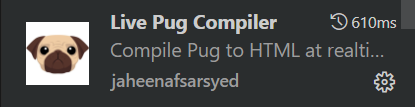
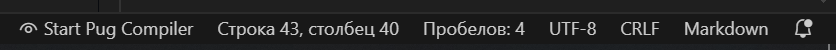

# Мой личный сайт

## Описание проекта

Этот проек это созданный мной сайт-блог в, котором есть определённое количество постов и есть навигация.

Проек можно модедифицировать и улучшать и я позволяю копировать мой проект и распростронять, но прошу указывать меня в исходниках кода.

## Запуск сайта

Чтобы запустить проект требуется найти папку `Compiled-HTML` в проекте и открыть файл `index.html`.

И у в браузере откроется наш блог. 

Дальше можете взаимодействовать с сайтом и обновлять. Будущие обновления будут появляться в этой папке.

## Установка Live Pug Compiler

Повозмосности прошу вас работать в [VS CODE](https://code.visualstudio.com/), но если вы работаете в другой среде вам потребуется скачать ноутбук или компьютер библиотеку [Live Pug Compiler](https://pypi.org/project/pug/) себе на ноутбук 

А в [VS CODE](https://code.visualstudio.com/) потребуется найти вкладку расширения и ввести туда `Live Pug Compiler`

И нажать на кнопку `Установить` (на скриншоте этого не увидете, потому что он у меня был установлен)

# Как работать с проектом

Чтобы работать с проектом обязательно потребуется скачать `Live Pug Compiler`. 

Когда вы установите `Live Pug Compiler` вам потребуется нажать на клавиши в комбинации 
CTRL+SHIFT+P потребуется ввести туда в поисковик `Start Pug Compiler` и нажать на кнопку и у вас появится кнопка на рабочей поверхности кнопка `Start Pug Compiler`, как на скриншоте и дальше вы нажимаете на её и все ваши обновления сохраняются автоматически.

# Цель проекта

Код написан в образовательных целях на онлайн-курсе для веб-разработчиков 
[dvmn.org.](http://https://dvmn.org/) .